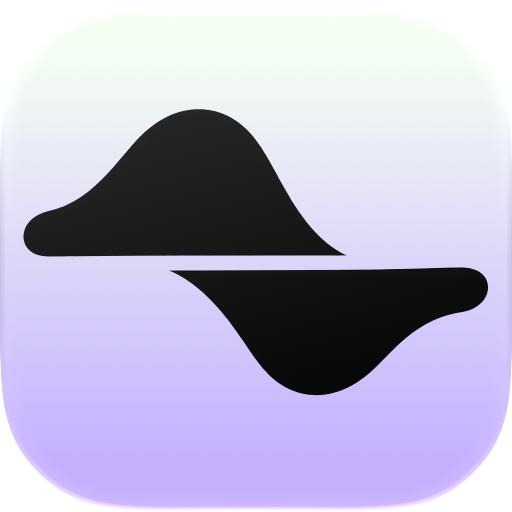
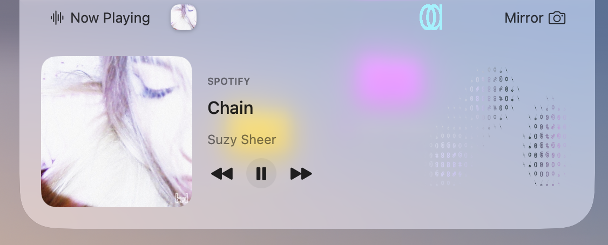
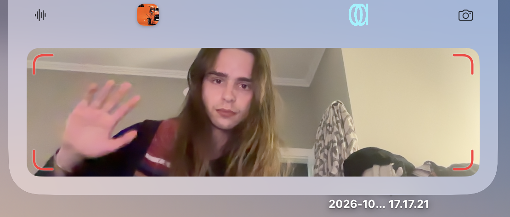
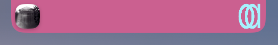
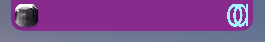
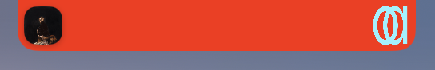
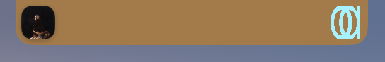
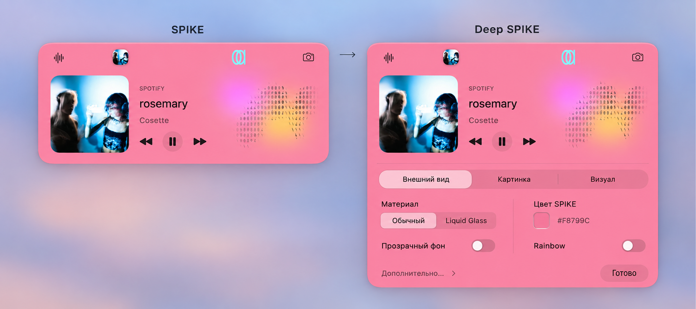
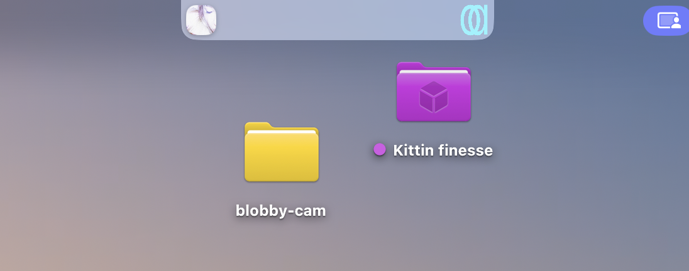

  <picture>
    <source media="(prefers-color-scheme: dark)" srcset="docs/assets/spike-icon-dark.png">
    
  </picture>
  <h1>SPIKE</h1>
  
<strong>A little space on either side.</strong>

  
Music on the left. Mirror on the right.

  

    <a href="https://github.com/kirilldodon2-ux/SPIKE/releases/tag/v0.1.0-preview.2">Download the preview</a> ·
    <a href="docs/INSTALL.md">First launch</a> ·
    <a href="docs/MANIFESTO.ru.md">Манифест · RU</a>
  

  
Native macOS · Apple Silicon · Open-source preview

https://github.com/user-attachments/assets/f63f63b8-74e8-4159-977b-9839b7b357a2

SPIKE GOES LIVE

## Small, on purpose

Not every useful moment needs a whole window.

Some things are needed for a few seconds: see what is playing, linger on an album cover, glance at yourself, catch a photo or a short video. Then carry on.

SPIKE gives those moments a small place around the Mac's notch. It stays close to what you are already doing, opens when you hover, and tucks away when you leave.

The music side is a pleasant place to look while listening, thinking or taking a little pause. The mirror side is a place to look into. Your own image or GIF makes that place yours.

Two everyday things, carefully made. That is the shape of SPIKE.

<strong>A player to look at. A mirror to look into.</strong>

## Music, within reach

See the current track, artwork and playback controls without leaving your work. Click the artwork or track details to return to the source app.

Playing music gets priority over browser media and incidental playback. The ASCII visual moves with the Mac's output audio and carries colours from the artwork into its own palette. When the audio is quiet, the visual is quiet too.

## A quick look at yourself

Open Mirror for a camera preview. Click for a photo. Hold to start a video with microphone sound, then click to stop.

Photos and videos are saved on your Mac, to Desktop or a folder you choose. The camera opens when you choose Mirror; the microphone is added only for a recording you start.

## Make the little space yours

Choose a colour, use the macOS palette, soften the background with transparency, or try Rainbow and experimental Liquid Glass. Text and controls follow the surface; artwork, camera pixels and your personal image keep their own colours.

Put a PNG, JPEG or GIF on the right. Add a little Pulse, Orbit, Breathe or VHS if you like. The same object can feel different while keeping its two familiar actions.

| Pink | Purple | Orange | Sand |
| :---: | :---: | :---: | :---: |
|  |  |  |  |

Right-click → **SPIKE settings** opens Deep SPIKE below the live surface. Change a setting and see the result above it.

Deep SPIKE — the design study

This is the design mockup that guided the settings layout. The screenshots above show the running app; this study is not a screenshot of the current controls.

At rest, on the desktop

The artwork and personal image stay nearby. Hover to open; move away to return to the compact surface.

## Try SPIKE

Open the [preview release](https://github.com/kirilldodon2-ux/SPIKE/releases/tag/v0.1.0-preview.2) and download **SPIKE-0.1.0-preview.2-arm64.dmg** under Assets.

1. Open the DMG and drag **SPIKE.app** to **Applications**.
2. Launch SPIKE from Applications.
3. If macOS asks, follow its app-specific **Open Anyway** flow.

This preview is ad-hoc signed, without Developer ID/notarization. You do not need Xcode or a terminal to install it. The source-code ZIP/TAR files are for developers. [First launch and the new-profile check](docs/INSTALL.md).

Compatibility and preview limits

| Item | Current status |
| --- | --- |
| Binary | Apple Silicon / arm64; Intel is not verified |
| Hardware | Main UX tested by the owner on a MacBook Pro M3 Pro |
| Minimum OS | Build metadata says macOS 14; this is not a tested support matrix |
| System audio visual | macOS 14.2+ and its system permission |
| Native Liquid Glass | macOS 26+; ordinary material fallback on unsupported/accessibility configurations |
| Downloaded first installation | Still awaiting the new-profile test; another Mac is also unverified |
| Updates / launch at login | Manual update; launch at login is not implemented |

Spotify and Music can be read through local Automation. Other system metadata uses a disableable experimental helper that relies on undocumented MediaRemote behaviour and may stop working after a macOS update. The visual analyses the Mac's combined output audio, which can include more than the selected track. Source-app permissions and platform failures can affect individual features.

The current screenshots show owner use and appearance choices. They are not a claim of broad hardware compatibility. [Full preview notes](docs/RELEASE_NOTES.md).

## Local by design

No SPIKE account, telemetry or cloud upload. Camera use is explicit, recordings stay local, and audio samples are analysed in memory without PCM files. macOS manages the permissions for each feature.

Some diagnostic errors can include media metadata. [Data and permissions](docs/PRIVACY.md).

## Built close to the Mac

Swift + AppKit + SwiftUI, with Metal for the visual. One native surface, with platform services behind it. No external Swift Package dependencies; the small media helper is vendored with its notice.

[Build from source](docs/BUILD.md) · [Development history](docs/HISTORY.md) · [Third-party notices](THIRD_PARTY_NOTICES.md)

SPIKE grew out of ONE / ONE NOOK as its own small experiment. Historical ONE names remain in paths and the bundle identifier.

Own code and project documentation use the [MIT licence](LICENSE). Third-party terms remain in force. Media artwork shown in the screenshots belongs to its respective creators; see the [image notes](docs/assets/README.md). Branding/assets review remains separate before public publication.

<strong>SPIKE / dodon.one</strong> Music beside your work. A mirror for a moment.

